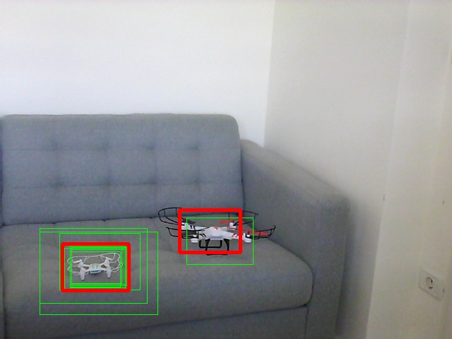

# Non-Maximum-Suppression - cascade 

A simple implementation of the Non-Maximum-Suppression algorithm (NMS), using OpenCV cascade classifier. Since the OpenCV cascade does not provide the detection confidence nor probability, the bounding box proposal is made on the rate of the intersection over the union (IOU) of the detected boxes. As input the following article was uesed [1], all credits for the concept does there.
<tr>
  <th>
  <a name="tracker" href=""></a>
  </th>
</tr>

Green - all detections, red - filtered results. For more customization see the next sections.


### How to use

If you don't have a custom cascade classifier trained for your purposes, you can create one, see details [2].
For testing purposes a detector is provided, which is trained to detect toy quadcopters:
```
/data/cascade.xml
```  
```
usage: test_cascade_nms.py [-h] [-cam CAM] [-n N] [-s S] [-iou IOU] [-so SO]
                           [-rev REV]

Cascade tester. Defaults: -cam 0 -n 0 -s 1.1 -iou 0.1

optional arguments:
  -h, --help  show this help message and exit
  -cam CAM    Camera ID
  -n N        Number of neighbors for detections
  -s S        Scale factor
  -iou IOU    Intersection Over Union threshold
  -so SO      Sort the detection based on their area, bigest the last
  -rev REV    Sort the detection based on their area, smallest the last

```


Playing with the cascade classifier parameters, detection rates can be improved i.e. by setting a lower value for the classifier's neighbor parameter. Usually having 2 neighbors settled gives good/clean results, but also decreases significantly the number of detections. The other approach would be o decrease this number to 1. For this situation, more false positives will appear, but tweaking the NMS algorithm parameters usually will give good results.


### TODO
 - Update NMS algorithm to accept an array of probabilities, for use cases with deep neuronal networks.
 - introduce the "Soft-NMS" for probability tuning - see paper [1]

Any contribution is welcomed! 


# Resources


1. [Improving Object Detection With One Line of Code](https://arxiv.org/pdf/1704.04503.pdf)
2. [Cascade tool - automate the retraining of cascade classifiers with OpenCV](https://github.com/fvilmos/cascade_tools)


/Enjoy.
